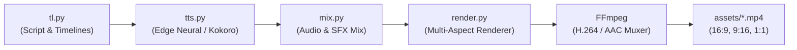

# ALGENZA Video Engine ⚡

[](https://www.python.org/)
[](LICENSE)
[](mix.py)
[](https://algenza.com)
[](cli.py)

A programmatic explainer video engine engineered specifically for **[ALGENZA](https://algenza.com)**: every frame, neural voiceover, synthesized cyber-quant soundtrack, and procedural sound effect is generated entirely by Python code — with **no manual video editor and no stock footage**.

Built for multi-platform social media distribution, it renders native formats for **YouTube (16:9)**, **TikTok / Instagram Reels / YouTube Shorts (9:16)**, and **LinkedIn / Twitter (1:1)**.

---

## 📺 Video Previews & Output Specifications

| Format | Resolution | Framerate | Target Platform | Generated Asset |
|---|---|---|---|---|
| **Widescreen Landscape** | 1920×1080 (16:9) | 60 fps | YouTube, Website Hero, Pitch Decks | `assets/algenza-explainer-16x9.mp4` |
| **Mobile Vertical** | 1080×1920 (9:16) | 60 fps | TikTok, Instagram Reels, Shorts | `assets/algenza-explainer-9x16.mp4` |
| **Square Feed** | 1080×1080 (1:1) | 60 fps | LinkedIn, Twitter / X, Instagram Feed | `assets/algenza-explainer-1x1.mp4` |

---

## 🏛️ Architecture & Pipeline



| Component | File | Description |
|---|---|---|
| **Script & Dynamic Timeline** | `tl.py` | Defines the 9 narrative scenes. Edit `LINES` to alter narration; all scene cue points, transitions, and camera math adapt automatically. |
| **Studio Neural Voice** | `tts.py` | Generates authoritative voiceover using Microsoft Edge Neural TTS (`en-US-ChristopherNeural` / `en-US-GuyNeural`) with Kokoro-ONNX and custom WAV fallback. |
| **Soundtrack & Sound Design** | `mix.py` | Synthesizes a progressive cyber-quant electronic soundtrack, procedural SFX (ticks, dings, whooshes, sub-bass booms), speech ducking, and `mouth.npy` for lip-sync. |
| **Universal Frame Renderer** | `render.py` | High-performance graphics renderer with responsive framing for 16:9, 9:16, and 1:1. Features the ALGENZA polygonal logo, Candlestick engine, and Quant Sentinel HUD. |
| **Multi-Platform CLI** | `cli.py` | Orchestrates single-command compilation for specific aspect ratios or all social formats simultaneously. |
| **Interactive Dashboard** | `index.html` & `server.py` | Glassmorphic web control center to preview scenes, test audio stems, and watch renders. |
| **1-Click Build Scripts** | `build.ps1`, `build.bat`, `build.sh` | Automated native runners for Windows PowerShell, Windows Batch, and Linux/macOS. |

---

## 🚀 Quick Start

### 1. Requirements
- Python 3.10+
- FFmpeg (bundled automatically via `imageio-ffmpeg`, or system FFmpeg)

### 2. Installation
```bash
git clone https://github.com/Shifrozy/ALGENZA-VideoGenerator.git
cd ALGENZA-VideoGenerator
pip install -r requirements.txt
```

### 3. Generate Video in 1-Click

#### On Windows (PowerShell):
```powershell
.\build.ps1
```
Or for all aspect ratios:
```powershell
.\build.ps1 -All
```

#### On Windows (Double-Click Batch):
Double click `build.bat` in File Explorer.

#### On Linux / macOS / Docker:
```bash
chmod +x build.sh
./build.sh
```

---

## 🛠️ CLI Usage & Advanced Commands

The `cli.py` script provides fine-grained control over exports:

```bash
# Display timeline breakdown and scene cue points
python cli.py info

# Render for YouTube (16:9 Landscape)
python cli.py build --aspect 16:9

# Render for TikTok / Reels / Shorts (9:16 Vertical)
python cli.py build --aspect 9:16

# Render for LinkedIn / Instagram Feed (1:1 Square)
python cli.py build --aspect 1:1

# Render all platforms in parallel
python cli.py build --aspect all --workers 4

# Preview still frame snapshots (generates PNG stills across scenes)
python cli.py preview --aspect 16:9
```

---

## 🎬 The 9 Narrative Scenes

1. **Scene 0 (0.0s – 4.3s) · You Have a Strategy**: Institutional Gold (XAUUSD) candlestick chart with real-time volatility moving average.
2. **Scene 1 (4.3s – 10.6s) · The Trader's Dilemma**: Fast-scrolling order flow wave, 24/7 global market liquidity pressure, and missed entry alerts.
3. **Scene 2 (10.6s – 17.7s) · ALGENZA Brand Reveal**: Signature dual-chevron geometric polygon assembly, electric cyan/rose shockwave, and sub-bass boom.
4. **Scene 3 (17.7s – 25.7s) · Algorithm Ecosystem**: 4 interactive glassmorphic cards showcasing *Apex Scalper Pro*, *Titan Grid Engine*, *Prop Risk Guard 360*, and *FIX API & Python Bridge*.
5. **Scene 4 (25.7s – 32.5s) · The 5-Step Quant Pipeline**: Interactive node graph tracking *Rules &rarr; MQL5 Code &rarr; 99.9% Real Tick Backtest &rarr; FIX API &rarr; Live Verified Execution*.
6. **Scene 5 (32.5s – 39.0s) · Prop-Firm Risk Guardians**: Daily loss gauges, FTMO pass shield, and smartphone mockup with live Telegram/Discord execution pings.
7. **Scene 6 (39.0s – 47.5s) · 100% Proprietary Code**: Deployment package file tree with verified architecture checkmarks and direct developer support.
8. **Scene 7 (47.5s – 54.1s) · Proven Track Record**: Dynamic counters displaying **200+ Delivered**, **$12M+ Volume**, **99.4% Win Rate**, and 5.0 Golden Stars.
9. **Scene 8 (54.1s – 68.0s) · High-Converting Call to Action**: Glowing CTA button directing viewers to **algenza.com** with direct WhatsApp contact.

---

## 🎨 ALGENZA Design System & Brand Tokens

| Token | Hex | Usage |
|---|---|---|
| `bg` | `#050b14` | Deep Navy Quant Space Background |
| `panel` | `#0c1524` | Glassmorphic Cards & UI Containers |
| `border` | `#1b2940` | Subtle Cyber Borders & Grid Lines |
| `teal` | `#70e0d6` | Primary Brand Color (Left Chevron Polygon) |
| `rose` | `#f49097` | Secondary Brand Color (Right Chevron Polygon) |
| `gold` | `#ffd700` | XAUUSD Gold Scalper & Rating Stars |
| `green` | `#00e676` | Verified Pass Rate & Profit Fills |
| `blue` | `#38bdf8` | FIX Protocol & Microsecond Latency |

---

## 🌐 Live Web Preview Dashboard

Launch the built-in local showcase dashboard to preview the generated video and inspect audio stems:

```bash
python server.py
```
Open **`http://localhost:8080`** in your browser.

---

## 👨‍💻 Executive Leadership & Support

- **Firm**: **ALGENZA** ([algenza.com](https://algenza.com))
- **Lead Quantitative Systems Engineer & CEO**: **Muhammad Hassan**
- **Direct WhatsApp**: [+92 319 7375850](https://wa.me/923197375850)
- **Email**: [muhammadhassanchanna8@gmail.com](mailto:muhammadhassanchanna8@gmail.com)
- **GitHub**: [@Shifrozy](https://github.com/Shifrozy)

---

## 📄 License

Distributed under the **MIT License**. See [`LICENSE`](LICENSE) for details.
