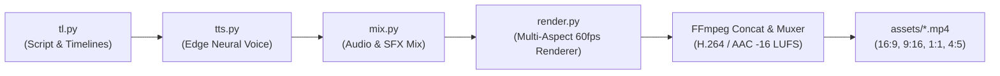

# ALGENZA Video Engine ⚡

[](https://www.python.org/)
[](LICENSE)
[](mix.py)
[](https://algenza.com)
[](cli.py)

A programmatic 60 FPS video generation engine engineered specifically for **[ALGENZA](https://algenza.com)**: every frame, neural voiceover, synthesized cyber-quant soundtrack, and procedural sound effect is generated entirely by Python code — with **no manual video editor and no stock footage**.

Built for multi-platform social media distribution, it renders native formats for **YouTube (16:9)**, **TikTok / Instagram Reels / YouTube Shorts (9:16)**, **Instagram / LinkedIn Feed (1:1)**, and **Instagram Portrait Feed (4:5)**.

---

## 📺 Multi-Format Video Specifications

| Format | Aspect Ratio | Resolution | Framerate | Target Platform | Output Asset |
|---|---|---|---|---|---|
| **Landscape** | `16:9` | 1920×1080 | 60 fps | YouTube, Website Hero, Pitch Decks | `assets/algenza-explainer-16x9.mp4` |
| **Vertical** | `9:16` | 1080×1920 | 60 fps | TikTok, Instagram Reels, YouTube Shorts | `assets/algenza-explainer-9x16.mp4` |
| **Square** | `1:1` | 1080×1080 | 60 fps | Instagram Feed, LinkedIn, Twitter / X | `assets/algenza-explainer-1x1.mp4` |
| **Portrait** | `4:5` | 1080×1350 | 60 fps | Instagram Feed (Tall), Facebook Feed | `assets/algenza-explainer-4x5.mp4` |

---

## 🤖 The ALGENZA Mascot: Cyber-Quant Trader

The engine features a distinctive, branded character:
- **Chassis & Body**: Aerodynamic rounded-capsule chassis in vibrant Algenza Emerald (`#3FCB90`) with dark titanium flank armor plates (`#10221A`) and glowing cyan pinstripes (`#00E5FF`).
- **Cyber Visor & Digital Eyes**: High-tech curved visor plate housing digital smart eyes with tracking pupils, blinking every 3.7s, worried angled brows in Scene 1, and joyful arcs (`^ ^`) in Scenes 2, 7, and 8.
- **Audio-Reactive Mouth**: Dynamic lip-sync directly modulated by voice speech envelope (`mouth.npy`), transitioning to a warm smile arc when resting.
- **Quantum Antenna & Ion Stabilizer**: Pulsing cyan/emerald signal antenna on top and dual-fin anti-gravity stabilizer at bottom.
- **Articulated Cyber Arms**: Pointing at charts and code panels with precision, waving enthusiastically in Scene 2 and Scene 8.
- **Blueprint Construction (Scene 0)**: Procedural assembly with compass sweeps, caliper dashed lines, coordinate crosshairs, and laser path tracing.

---

## 🏛️ Engine Architecture & Pipeline



| Component | File | Description |
|---|---|---|
| **Script & Dynamic Timeline** | `tl.py` | Defines the 9 narrative scenes. Edit `LINES` to alter narration; all scene cue points, camera zooms, and sound events adapt automatically. |
| **Studio Neural Voice** | `tts.py` | Generates authoritative voiceover using Microsoft Edge Neural TTS (`en-US-ChristopherNeural` / `en-US-GuyNeural`) with local fallbacks. |
| **Soundtrack & Sound Design** | `mix.py` | Synthesizes a progressive cyber-quant electronic soundtrack, procedural SFX (ticks, dings, whooshes, sub-bass booms), speech ducking, and `mouth.npy` for lip-sync. |
| **Multi-Format Frame Renderer** | `render.py` | High-performance 60fps graphics renderer powered by pure-Python Skia engine with zero native crashes on Windows. |
| **Multi-Platform CLI** | `cli.py` | Orchestrates parallel multi-worker rendering, audio muxing, and format exports. |
| **Interactive Dashboard** | `index.html` & `server.py` | Glassmorphic web control center to preview scenes, test audio stems, and watch renders. |
| **1-Click Build Scripts** | `build.ps1`, `build.bat`, `build.sh` | Automated native runners for Windows PowerShell, Windows Batch, and Linux/macOS. |

---

## 🚀 Quick Start

### 1. Requirements
- Python 3.10+
- FFmpeg (bundled automatically via `imageio-ffmpeg`, or system FFmpeg)

### 2. Installation
```bash
git clone https://github.com/Shifrozy/ALGENZA-VideoGenerator.git
cd ALGENZA-VideoGenerator
pip install -r requirements.txt
```

### 3. Generate Video in 1-Click

#### On Windows (PowerShell):
```powershell
# Render YouTube Widescreen (16:9)
.\build.ps1

# Or render all 4 formats (16:9, 9:16, 1:1, 4:5)
.\build.ps1 -All
```

#### On Windows (Command Prompt / Double Click):
```cmd
build.bat 16:9
```
Or double-click `build.bat` in File Explorer.

#### On Linux / macOS / Docker:
```bash
chmod +x build.sh
./build.sh
```

---

## 🛠️ CLI Usage & Advanced Commands

The `cli.py` script provides fine-grained control over exports:

```bash
# Display narrative script timeline and scene timestamps
python cli.py info

# Render for YouTube (16:9 Landscape - 1920x1080)
python cli.py build --aspect 16:9 --workers 4

# Render for TikTok / Reels / Shorts (9:16 Vertical - 1080x1920)
python cli.py build --aspect 9:16 --workers 4

# Render for LinkedIn / Instagram (1:1 Square - 1080x1080)
python cli.py build --aspect 1:1 --workers 4

# Render for Instagram / Facebook Feed (4:5 Portrait - 1080x1350)
python cli.py build --aspect 4:5 --workers 4

# Render all 4 formats in parallel
python cli.py build --aspect all --workers 4

# Preview still frame snapshots (generates PNG stills across scenes)
python cli.py preview --aspect 16:9
python cli.py preview --aspect 9:16
python cli.py preview --aspect 1:1
python cli.py preview --aspect 4:5
```

---

## 🎬 The 9 Narrative Scenes

1. **Scene 0 (0.0s – 4.3s) · You Have a Strategy**: Institutional Gold (XAUUSD) candlestick chart with real-time volatility moving average and mascot blueprint assembly.
2. **Scene 1 (4.3s – 10.6s) · The Trader's Dilemma**: Fast-scrolling order flow wave, 24/7 global market liquidity clock, missed entry alerts, and worried mascot expression.
3. **Scene 2 (10.6s – 17.7s) · ALGENZA Brand Reveal**: Glowing ALGENZA logo drop, cinematic laser sweep, and mascot welcoming wave.
4. **Scene 3 (17.7s – 25.7s) · Algorithm Ecosystem**: Responsive cards showcasing *MT4/MT5 Expert Advisors*, *IBKR API*, and *Crypto Exchange Bots*.
5. **Scene 4 (25.7s – 32.5s) · The 5-Step Quant Pipeline**: Interactive node graph tracking *Rules &rarr; Code &rarr; Real Tick Backtest &rarr; Broker API &rarr; Live Verified Execution*.
6. **Scene 5 (32.5s – 39.0s) · Risk Management Built In**: Strict loss gauges (Max daily loss, 1% risk per trade) and smartphone mockup with live Telegram/Discord alerts.
7. **Scene 6 (39.0s – 47.5s) · No Black Box**: Deployment package directory tree with verified architecture checkmarks and direct developer support.
8. **Scene 7 (47.5s – 54.1s) · Proven in Production**: Dynamic counters displaying **200+ Delivered**, **4.9 Client Rating**, and 5 Golden Stars.
9. **Scene 8 (54.1s – 68.0s) · High-Converting Call to Action**: Glowing CTA button directing viewers to **algenza.com**.

---

## 🎨 ALGENZA Design System & Brand Tokens

| Token | Hex | Usage |
|---|---|---|
| `G` (Emerald) | `#3FCB90` | Primary Algenza Brand Color, Bullish Candles, Mascot Armor |
| `CYAN` | `#00E5FF` | Quantum Accents, Sensor LEDs, Visor Contours |
| `WH` (White) | `#F1F3F6` | Primary Headings, Text Labels, Arm Nodes |
| `MU` (Slate) | `#8B9A92` | Subtitles, Muted Grid Lines, Code Comments |
| `RD` (Red) | `#EF4444` | Missed Entry Alerts, Bearish Candles |
| `PN` (Panel) | `#11151C` | Deep Glassmorphic Cards & UI Containers |
| `LN` (Border) | `#252C38` | Subtle Cyber Borders & Division Rings |
| `DK` (Dark) | `#07251A` | Visor Interior, Pupils, Mouth Cavity |

---

## 🌐 Live Web Showcase Dashboard

Launch the built-in local showcase dashboard to preview the generated video and inspect audio stems:

```bash
python server.py
```
Open **`http://localhost:8080`** in your browser.

---

## 👨‍💻 Executive Leadership & Support

- **Firm**: **ALGENZA** ([algenza.com](https://algenza.com))
- **Lead Quantitative Systems Engineer & CEO**: **Muhammad Hassan**
- **Direct WhatsApp**: [+92 319 7375850](https://wa.me/923197375850)
- **Email**: [muhammadhassanchanna8@gmail.com](mailto:muhammadhassanchanna8@gmail.com)
- **GitHub**: [@Shifrozy](https://github.com/Shifrozy)

---

## 📄 License

Distributed under the **MIT License**. See [`LICENSE`](LICENSE) for details.
